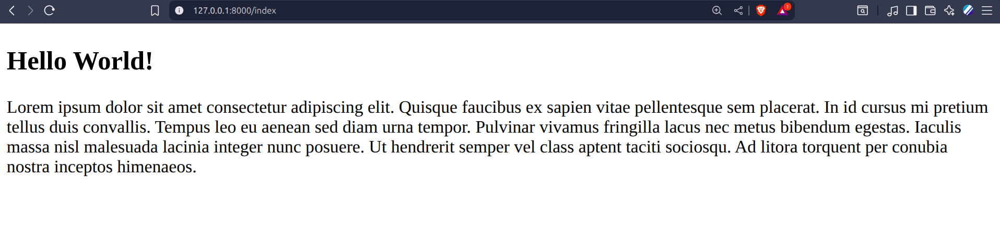

## Template and Static File

In Django, a template is basically an HTML file that is used to display data dynamically to the user.

It’s part of Django’s MVT (Model–View–Template) architecture (similar to MVC).
Templates control how the data looks — not what the data is or how it’s processed.

#### Step- 1: To create a template in django app create a template folder and inside that create the html template file name it myapp.html

#### Step- 2: Create a view function and in return to the function send it to the html template location 

#### Step- 3: But before sending it , it need to convert into string , so import the render to string pakage in views.py file
```py  
from django.template.loader import render_to_string
...
...
...
def index(request):

    response_data = render_to_string('myapp/myapp.html')
    return HttpResponse(response_data)

```

#### Now if we run the development server , it says it cant find the myapp.html file . The reason is simple , as we dont connect our app to the main project it couldn't find it. 

#### For that we have two possible way 

#### 1. Add the app in the list of Installed app 
```py
INSTALLED_APPS = [
    'django.contrib.admin',
    'django.contrib.auth',
    'django.contrib.contenttypes',
    'django.contrib.sessions',
    'django.contrib.messages',
    'django.contrib.staticfiles',
    'myapp'
]
```
###### point to be noted that in that case we must careful about the template folder name , it must be "templates" , otherwise it won't work And another thing under the Templates = [....] APP_DIRS must be true

```py
TEMPLATES = [
    {
        'BACKEND': 'django.template.backends.django.DjangoTemplates',
        'DIRS': [
            
        ],
        'APP_DIRS': True,
        'OPTIONS': {
            'context_processors': [
                'django.template.context_processors.request',
                'django.contrib.auth.context_processors.auth',
                'django.contrib.messages.context_processors.messages',
            ],
        },
    },
]
```

#### 2. We need to add the template folder to the Template section list 

```py
TEMPLATES = [
    {
        'BACKEND': 'django.template.backends.django.DjangoTemplates',
        'DIRS': [
            BASE_DIR / "myapp" / "template"
        ],
        'APP_DIRS': True,
        'OPTIONS': {
            'context_processors': [
                'django.template.context_processors.request',
                'django.contrib.auth.context_processors.auth',
                'django.contrib.messages.context_processors.messages',
            ],
        },
    },
]
```
#### Now if we run the server and go to the http://127.0.0.1:8000/index we can see the html file output
