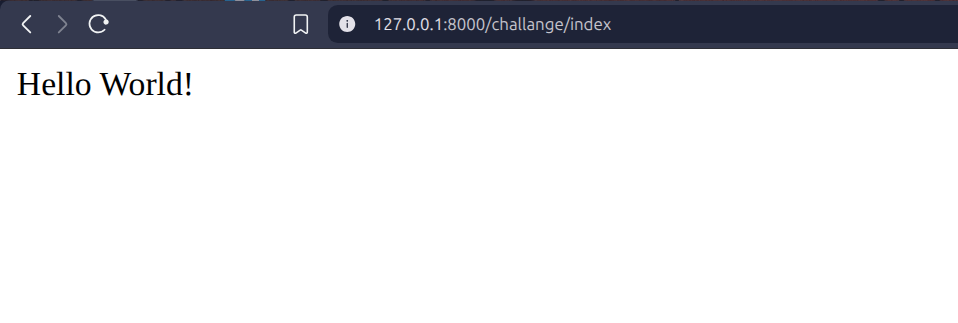

## URL in django
In Django, the urls.py file defines the routes (or paths) of your web application.

It tells Django which view function or class should handle a particular URL requested by the user.

## VIEW in django 
A view in Django is a Python function or class that takes a web request and returns a web response.
It’s where the main logic of your web application lives — fetching data, rendering templates, or processing forms.

#### Here we have a app name "challenges"

So for understanding Views and Urls , first create a view function in the views.py file

```py
def myfunction(request):

    return HttpResponse("Hello World!")

```

Now for displaying the view Function we created we need to create a url where it will display

So , first create a urls.py file in challenges app
Then import the necessary packages and then import the views so that it can get the function 

then add the urls file in the parent urls (monthly_challenges/urls.py) so that it can be aware of my newly created urls file

```py
urlpatterns = [
    ...
    ...
    ...,
    path('challange/', include("challanges.urls"))
]
```

Here as we want our view in the http://127.0.0.1:8000/challange/... url thats why use challenges here 

Now in challenges/urls.py 

```py
urlpatterns = [

    path("index", views.myfunction ),
]
```
set a path where we want to display the function , here i want index , so my end point will be http://127.0.0.1:8000/challange/index and then mention the function name ,here it was myfunction 

